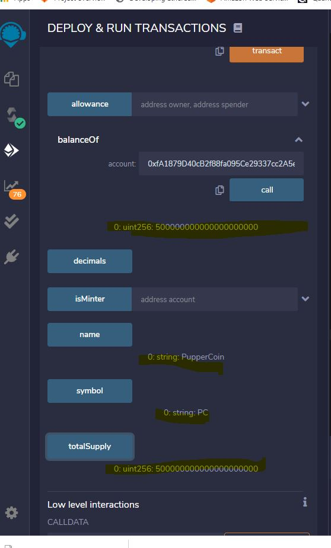

## PupperCoin 

###Track your dog's lineage using DNA

The Puupercoin network tracks dog breeding activity across the globe in a decentralized way, and allow humans to track the genetic trail of anmicals. We will raise a maximum of 300 Ether. The crowdsale will run for 24 weeks.

Deployed on Kovan Testnet

Transaction Hash:
0x662f1545B26Cde11f38AE897f228777401B7E07F

https://kovan.etherscan.io/address/0x662f1545b26cde11f38ae897f228777401b7e07f

# Pupper

In this contract, 10,000 wei are minted and offered for sale. Metamask can be used to add the custom token. Transfers are shown below.

Deployed on Ropsten Testnet

Transaction Hash:
0xfc4265c92dbe1706fb540fac1b4dd63529945a6e8986430c9cc29235875dedd0 

https://ropsten.etherscan.io/tx/0xfc4265c92dbe1706fb540fac1b4dd63529945a6e8986430c9cc29235875dedd0

